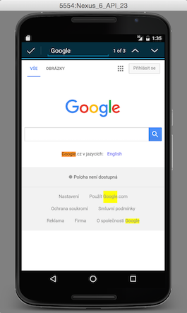

# Part 1 - UI Automator

In this part of the code lab we create Android test using **UI Automator** library. You can use the UI Automator library to test multiple applications as well as system applications.

UI Automator provides you with a couple of API classes which you can use for your tests.

The most important classes:

* `UiDevice`
* `UiObject`
* `UiSelector`
* `UiCollection`
* `UiScrollable`
* `Configurator`

## UiDevice

[UiDevice API documentation](https://developer.android.com/reference/android/support/test/uiautomator/UiDevice.html)

> `UiDevice` provides access to state information about the device. You can also use this class to simulate user actions on the device, such as pressing the d-pad or pressing the Home and Menu buttons.

You use `UiDevice` class during writing your tests very often.

Some methods that might be handy to you:

* `click()`, `drag()` and more gestures
* `findObject()` and `findObjects()`
* `hasObject()`
* `performActionAndWait()`
* `pressBack()`, `pressEnter()`, `pressMenu()` and more actions
* `wait()`
* and more...

## UiObject

[UiObject API documentation](https://developer.android.com/reference/android/support/test/uiautomator/UiObject.html)

> A `UiObject` is a representation of a view. It is not in any way directly bound to a view as an object reference. A UiObject contains information to help it locate a matching view at runtime based on the UiSelector properties specified in its constructor. Once you create an instance of a UiObject, it can be reused for different views that match the selector criteria.

You use `UiObject` class for working with views. When you search for an object through the `findObject()` method, the `UiObject` instance is returned.

We can call methods to perform actions on the view and we are also able to retrieve a couple of properties from the retrieved view.

Some methods that might be handy to you:

* `click()`, `swipeDown()` and more gestures
* `clickAndWaitForNewWindow()`
* `exists()`
* `getChild()`
* `getChildCount()`
* `getClassName()`
* `getContentDescription()`
* `getText()`
* `isChecked()`, `isClickable()`, `isEnabled()`, `isScrollable()` and more
* `setText()`
* and more...

## UiSelector

[UiSelector API documentation](https://developer.android.com/reference/android/support/test/uiautomator/UiSelector.html)

> Specifies the elements in the layout hierarchy for tests to target, filtered by properties such as text value, content-description, class name, and state information. You can also target an element by its location in a layout hierarchy.
  
You use `UiSelector` to search for `UiObject`s on the display. You create a new `UiSelector` and specify properties of your searched object. Always the **first** matching element in the layout hierarchy is returned. If no matching UI element is found, a `UiAutomatorObjectNotFoundException` is thrown.

Selector might look like this:

```java
UiObject OkButton = device.findObject(new UiSelector()
    .text("Ok"))
    .className("android.widget.Button"));
```

Some methods that might be handy to you:

* `className()`
* `clickable()`, `checkable()`, `enabled()` and more
* `description()`, `descriptionContains()` and more
* `resourceId()`
* `text()`, `textContains()` and more
* `childSelector()`
* and more...

## UiCollection

[UiCollection API documentation](https://developer.android.com/reference/android/support/test/uiautomator/UiCollection.html)

> Used to enumerate a container's UI elements for the purpose of counting, or targeting a sub elements by a child's text or description.

Use `UiCollection` for simulating user interactions on a collection of views.

## UiScrollable

[UiScrollable API documentation](https://developer.android.com/reference/android/support/test/uiautomator/UiScrollable.html)

> `UiScrollable` is a `UiCollection` and provides support for searching for items in scrollable layout elements. This class can be used with horizontally or vertically scrollable controls.

Use `UiScrollable` when your view is hidden behind a scroll. For example in `ListView`.

Example:

```java
UiScrollable appViews = new UiScrollable(new UiSelector().scrollable(true));
appViews.setAsHorizontalList();

UiObject app = appViews.getChildByText(new UiSelector()
    .className("android.widget.TextView"), "My super app");
```

Some methods that might be handy to you:

* `getChildByText()`, `getChildByDescription()` and more
* `scrollIntoView()`, `scrollToBeginning()` and more
* `setAsHorizontalList()`, `setAsVerticalList()`
* and more...

## Configurator
[Configurator API documentation](https://developer.android.com/reference/android/support/test/uiautomator/Configurator.html)

> Allows you to set key parameters for running uiautomator tests. The new settings take effect immediately and can be changed any time during a test run.

## Instrumentation

[Instrumentation API documentation](https://developer.android.com/reference/android/app/Instrumentation.html)

> Base class for implementing application instrumentation code. When running with instrumentation turned on, this class will be instantiated for you before any of the application code, allowing you to monitor all of the interaction the system has with the application.

You can use this class to retrieve context, for starting Activities and more.

## UI Automator Viewer

With UI Automator we can write tests for any application, e.g. we don't need to have a source code. But how can we get information about view components to be able to retrieve them in our test? **UI Automator Viewer** is the tool exactly for this.

### Run UI Automator Viewer 

UI Automator Viewer is present in `<android-sdk>/tools/` folder. Connect your device or run emulator to be able to do a device screenshot and inspect the layout.

### What we can do and retrieve?

With UI Automator Viewer you can see actual layout hierarchy and retrieve information about view components such as its bounds, content description, state information and more.


## Code lab

We write two simple tests using UI Automator library in this code lab. Because we can use UI Automator to test system apps, we write the first test for the Calculator app and the second test for the Browser app.

> Attention: Both tests assume that your device is in the english language. Some views are retrieved by some containing text so the text might be different in some other language. For example **Calculator** app would be **Kalkulačka** in czech language. If you use a different language, update the selectors to match your local names.

> Tests works on Nexus 6, Android 6, with english language.

### Step 1 - Open the project

We start with the folder `start`. Here you find an empty project where all the needed dependencies are added. Just run Gradle sync on your `build.gradle` file. You can see there dependencies for test runner and UI Automator.

Explore the `src/androidTest/java` folder. You can find here an empty `AutomatorTest` class in package `net.moudra.uiautomatorapp`. We write our two tests here.

### Step 2 - Explore the class

The `AutomatorTest` class is empty at the moment. The class has two annotations. The `@RunWith` defines that it uses JUnit 4-compatible test runner for Android and `@SdkSuppress` describes that the test will not run on the lowest Android version than 18.

```java
@RunWith(AndroidJUnit4.class)
@SdkSuppress(minSdkVersion = 18)
public class AutomatorTest {

}
```

We create two test methods - one for testing the Calculator app and the second one for the Browser app.

### Step 3 - Before test

With UI Automator, we need to get the instance of `UiDevice` first. We will do this in our JUnit annotated `@Before` method and we save our device into local variable `uiDevice`:

```java
@RunWith(AndroidJUnit4.class)
@SdkSuppress(minSdkVersion = 18)
public class AutomatorTest {
    private UiDevice uiDevice;

    @Before
    public void beforeTest() {
        uiDevice = UiDevice.getInstance(InstrumentationRegistry.getInstrumentation());
        uiDevice.pressHome();
    }
}
```

Before every test, the `@Before` annotated method is run. It saves an instance of `UiDevice` and opens the Android's home screen.

### Step 4 - After test

We also add here the `@After` test method to go again to home screen after every test.

```java
@RunWith(AndroidJUnit4.class)
@SdkSuppress(minSdkVersion = 18)
public class AutomatorTest {
    private UiDevice uiDevice;

    @Before
    public void beforeTest() {
        uiDevice = UiDevice.getInstance(InstrumentationRegistry.getInstrumentation());
        uiDevice.pressHome();
    }
    
    @After
    public void afterTest() {
        uiDevice.pressHome();
    }
}
```

### Step 5 - Calculator App test

Let's write our test for the Calculator app. Create a `@Test` annotated method:

```java
@Test
public void testCalculator() throws Exception {

}
```

The process for the Calculator app test looks like this:

1. Open the apps screen
2. Retrieve the scrollable view with apps
3. Search for the app in the scrollable view and open it
4. Press the clear button to delete possible previous values on the display
5. Calculate the sum of two values, 3 and 5
6. Check the sum


Let's implement the test! Implement this code to our `testCalculator()` method:

#### Open the apps screen

Find the view with "Apps" description, validate it, click on it and wait for the new window.

```java
// Home screen apps button
UiObject appButton = uiDevice.findObject(new UiSelector().descriptionContains("Apps"));
assertTrue(appButton.exists());

appButton.clickAndWaitForNewWindow();
```

#### Retrieve the scrollable view with apps

Find the scrollable element in apps, validate it, and set it as horizontal list to be able to scroll horizontally.

```java
// Scrollable view with apps
UiScrollable appViews = new UiScrollable(new UiSelector().scrollable(true));
assertTrue(appViews.exists());

appViews.setAsHorizontalList();
```

#### Search for the app in the scrollable view and open it

Search for the app with name "Calculator", validate it, click on it and wait for the new window.

```java
// Find calculator application
UiObject calculatorApp = appViews.getChildByText(new UiSelector()
        .className("android.widget.TextView"), "Calculator");
assertTrue(calculatorApp.exists());

calculatorApp.clickAndWaitForNewWindow();
```

#### Press the clear button to delete possible previous values on the display

> Warning: This is an important step. The test might fail next time if the value on the display is not cleared.

Search for the view with text either "clr" or "del", validate it and do a long click.

```java
// Use calculator app
UiObject clearButton = uiDevice.findObject(new UiSelector().textMatches("clr|del"));
assertTrue(clearButton.exists());
clearButton.longClick();
```

#### Calculate the sum of two values, 3 and 5

Retrieve every button, validate it and click on it.

```java
UiObject threeButton = uiDevice.findObject(new UiSelector().text("3"));
assertTrue(threeButton.exists());
threeButton.click();

UiObject plusButton = uiDevice.findObject(new UiSelector().text("+"));
assertTrue(plusButton.exists());
plusButton.click();

UiObject fiveButton = uiDevice.findObject(new UiSelector().text("5"));
assertTrue(fiveButton.exists());
fiveButton.click();

UiObject equalsButton = uiDevice.findObject(new UiSelector().text("="));
assertTrue(equalsButton.exists());
equalsButton.click();
```

#### Check the sum

Check the final sum on the display if it matches the expected result.

```java
UiObject display = uiDevice.findObject(new UiSelector()
        .resourceId("com.android.calculator2:id/display"));
assertTrue(display.exists());

// Validate
UiObject displayNumber = display.getChild(new UiSelector().index(0));
assertTrue(displayNumber.exists());
assertEquals(displayNumber.getText(), "8");
```

We are done here!

### Step 6 - Browser App test
    
Let's write our next test for the browser app. Create a `@Test` annotated method:
    
```java
@Test
public void testBrowserApp() throws Exception {

}
```
    
The process for the Browser App test looks like this:

1. Open the apps screen
2. Retrieve the scrollable view with apps
3. Search for the app in the scrollable view and then open it
4. Type the url into the browser and wait to load
5. Open the menu and find on page
6. Search for the keyword
7. Dismiss the search



Let's implement the second test! Implement this code to our `testBrowserApp()` method:

#### Open the apps screen

Find the view with "Apps" description, validate it, click on it and wait for the new window. We have already seen this in our previous test.

```java
// Home screen apps button
UiObject appButton = uiDevice.findObject(new UiSelector().descriptionContains("Apps"));
assertTrue(appButton.exists());

appButton.clickAndWaitForNewWindow();
```

#### Retrieve the scrollable view with apps

Find the scrollable element in apps, validate it, and set it as horizontal list to be able to scroll horizontally. We have already seen this in our previous test.

```java
// Scrollable view with apps
UiScrollable appViews = new UiScrollable(new UiSelector().scrollable(true));
assertTrue(appViews.exists());

appViews.setAsHorizontalList();
```

#### Search for the app in the scrollable view and then open it

Search for the app with name "Browser", validate it, click on it and wait for the new window.

```java
// Find browser application
UiObject browserApp = appViews.getChildByText(new UiSelector()
        .className("android.widget.TextView"), "Browser");
assertTrue(browserApp.exists());
browserApp.clickAndWaitForNewWindow();
```

#### Type the url into the browser and wait to load

Search for the browser url view with resource id `com.android.browser:id/url`, validate it and click on it. Then set the text to www.google.com and press enter.

We want to wait some time before the page is loaded. We wait 10 seconds because of the `SystemClock.sleep()` method.

```java
// Browser App set url
UiObject urlForm = uiDevice.findObject(new UiSelector()
        .resourceId("com.android.browser:id/url"));
assertTrue(urlForm.exists());
urlForm.click();
urlForm.setText("www.google.com");
uiDevice.pressEnter();

// Wait to load page
SystemClock.sleep(10000);
```

#### Open the menu and find on page

Open the menu by calling `pressMenu()` on `UiDevice` and then search for the view with "Find on page" text. Validate it and click on it.

```java
// Show menu
uiDevice.pressMenu();

// Find text on page
UiObject findButton = uiDevice.findObject(new UiSelector()
        .text("Find on page"));
assertTrue(findButton.exists());
findButton.click();
```

#### Search for the keyword

Find the search field with resource id `android:id/edit`, click on it, type there "Google" and press enter. Then wait two seconds.

```java
UiObject findView = uiDevice.findObject(new UiSelector()
                .resourceId("android:id/edit"));
assertTrue(findView.exists());
findView.click();
findView.setText("Google");
uiDevice.pressEnter();

SystemClock.sleep(2000);
```

#### Dismiss the search

Dismiss the search field to avoid problems with running the test again.

```java
// Dismiss search
UiObject okButtonView = uiDevice.findObject(new UiSelector()
        .resourceId("com.android.browser:id/iconcombo"));
assertTrue(okButtonView.exists());
okButtonView.click();
```

### Run tests

Select `Run AutomatorTest` with emulator launched or device connected.

See how it goes through the both applications.

### Result

Whole test source code:

```java
@RunWith(AndroidJUnit4.class)
@SdkSuppress(minSdkVersion = 18)
public class AutomatorTest {
    private UiDevice uiDevice;

    @Before
    public void beforeTest() {
        uiDevice = UiDevice.getInstance(InstrumentationRegistry.getInstrumentation());
        uiDevice.pressHome();
    }

    @After
    public void afterTest() {
        uiDevice.pressHome();
    }

    @Test
    public void testCalculator() throws Exception {
        // Home screen apps button
        UiObject appButton = uiDevice.findObject(new UiSelector().descriptionContains("Apps"));
        assertTrue(appButton.exists());

        appButton.clickAndWaitForNewWindow();

        // Scrollable view with apps
        UiScrollable appViews = new UiScrollable(new UiSelector().scrollable(true));
        assertTrue(appViews.exists());

        appViews.setAsHorizontalList();

        // Find calculator application
        UiObject calculatorApp = appViews.getChildByText(new UiSelector()
                .className("android.widget.TextView"), "Calculator");
        assertTrue(calculatorApp.exists());

        calculatorApp.clickAndWaitForNewWindow();

        // Use calculator app
        UiObject clearButton = uiDevice.findObject(new UiSelector().textMatches("clr|del"));
        assertTrue(clearButton.exists());
        clearButton.longClick();

        UiObject threeButton = uiDevice.findObject(new UiSelector().text("3"));
        assertTrue(threeButton.exists());
        threeButton.click();

        UiObject plusButton = uiDevice.findObject(new UiSelector().text("+"));
        assertTrue(plusButton.exists());
        plusButton.click();

        UiObject fiveButton = uiDevice.findObject(new UiSelector().text("5"));
        assertTrue(fiveButton.exists());
        fiveButton.click();

        UiObject equalsButton = uiDevice.findObject(new UiSelector().text("="));
        assertTrue(equalsButton.exists());
        equalsButton.click();

        UiObject display = uiDevice.findObject(new UiSelector()
                .resourceId("com.android.calculator2:id/display"));
        assertTrue(display.exists());

        // Validate
        UiObject displayNumber = display.getChild(new UiSelector().index(0));
        assertTrue(displayNumber.exists());
        assertEquals(displayNumber.getText(), "8");
    }

    @Test
    public void testBrowserApp() throws Exception {
        // Home screen apps button
        UiObject appButton = uiDevice.findObject(new UiSelector().descriptionContains("Apps"));
        assertTrue(appButton.exists());

        appButton.clickAndWaitForNewWindow();

        // Scrollable view with apps
        UiScrollable appViews = new UiScrollable(new UiSelector().scrollable(true));
        assertTrue(appViews.exists());

        appViews.setAsHorizontalList();

        // Find browser application
        UiObject browserApp = appViews.getChildByText(new UiSelector()
                .className("android.widget.TextView"), "Browser");
        assertTrue(browserApp.exists());
        browserApp.clickAndWaitForNewWindow();

        // Browser App set url
        UiObject urlForm = uiDevice.findObject(new UiSelector()
                .resourceId("com.android.browser:id/url"));
        assertTrue(urlForm.exists());
        urlForm.click();
        urlForm.setText("www.google.com");
        uiDevice.pressEnter();

        // Wait to load page
        SystemClock.sleep(10000);

        // Show menu
        uiDevice.pressMenu();

        // Find text on page
        UiObject findButton = uiDevice.findObject(new UiSelector()
                .text("Find on page"));
        assertTrue(findButton.exists());
        findButton.click();

        UiObject findView = uiDevice.findObject(new UiSelector()
                .resourceId("android:id/edit"));
        assertTrue(findView.exists());
        findView.click();
        findView.setText("Google");
        uiDevice.pressEnter();

        SystemClock.sleep(2000);

        // Dismiss search
        UiObject okButtonView = uiDevice.findObject(new UiSelector()
                .resourceId("com.android.browser:id/iconcombo"));
        assertTrue(okButtonView.exists());
        okButtonView.click();
    }
}
```

# More resources

* [UI Automator testing](https://developer.android.com/training/testing/ui-testing/uiautomator-testing.html)
* [UI Automator](https://developer.android.com/topic/libraries/testing-support-library/index.html#UIAutomator)
