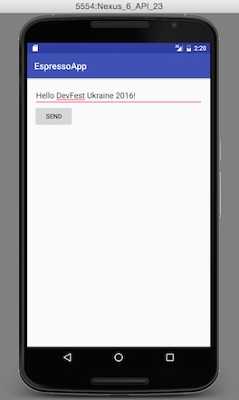

# Part 2 - Espresso

In this part of the code lab we create Android test using **Espresso** library. You can use Espresso to test one application and you need to have app source codes to be able to write the test.

Espresso provides you with a couple of API classes which you can use for writing your tests.

The most important classes:

* `ActivityTestRule`
* `ViewMatchers`
* `ViewActions`
* `ViewAssertions`

## ActivityTestRule

[ActivityTestRule API documentation](https://developer.android.com/reference/android/support/test/rule/ActivityTestRule.html)

> This rule provides functional testing of a single activity. The activity under test will be launched before each test annotated with Test and before methods annotated with Before. It will be terminated after the test is completed and methods annotated with After are finished. During the duration of the test you will be able to manipulate your Activity directly.

## ViewMatchers

[ViewMatchers API documentation](https://developer.android.com/reference/android/support/test/espresso/matcher/ViewMatchers.html)

> A collection of hamcrest matchers that match Views.

Some methods that might be handy to you:

* `assertThat()`
* `hasContentDescription()`
* `isChecked()`, `isClickable()`, `isSelected()` and more
* `withClassName()`, `withContentDescription()`, `withId()`, `withText()` and more
* and more

## ViewActions

[ViewActions API documentation](https://developer.android.com/reference/android/support/test/espresso/action/ViewActions.html)

> A collection of common ViewActions.
  
Some methods that might be handy to you:

* `click()`, `doubleClick()`, `longClick()` and more
* `clearText()`, `replaceText()`, `typeText()`
* `pressBack()`, `pressKey()`, `pressMenuKey()` and more
* `scrollTo()`, `swipeDown()` and more
* and more

## ViewAssertions
 
[ViewAssertions API documentation](https://developer.android.com/reference/android/support/test/espresso/assertion/ViewAssertions.html)
 
> A collection of common ViewAssertions.

Usually we use the `matches()` method if the view is matched by the `ViewMatcher`.

## How to retrieve elements?

To retrieve element from hierarchy we call `onView()` method with correct `ViewMatcher`. If the match is not found, it throws a `NoMatchingViewException`.

Example:

```java
onView(withId(R.id.name_edittext));
```

With some `AdapterView` (for example `ListView`), the method `onData()` instead of `onView()` must used.

After that you can call some interaction method through the `ViewActions` class.

Example:

```java
onView(withId(R.id.name_edittext))
    .perform(typeTextIntoFocusedView("Hello"));
```

And then you can check the result with the `ViewAssertions` class:

```java
onView(withId(R.id.name_edittext))
    .perform(typeTextIntoFocusedView("Hello"))
    .check(matches(withText("Hello")));
```

## Code lab

We write a test for our simple application using the Espresso library in this code lab.

### Step 1 - Open the project

We start with the folder `start`. Here you find an empty project where all the needed dependencies are added. Just run Gradle sync on your `build.gradle` file. You can see there dependencies for test runner and Espresso.

Explore the `src/main/java` folder. You can find here two Activities. The `MainActivity` and the `DetailActivity` in the package `net.moudra.espressoapp`. This application is simple. We have a form on our main screen and whenever the form is sent, the value is passed and shown in the second window.

Then explore the `src/androidTest/java` folder. You can find here an empty `EspressoTest`. We write our test here.

### Step 2 - Explore the class

The `EspressoTest` class is empty at the moment. The class has `@RunWith` annotation. It defines that it uses JUnit 4-compatible test runner for Android.

```java
@RunWith(AndroidJUnit4.class)
public class EspressoTest {

}
```

### Step 3 - Rules

We provide here `ActivityTestRule` to launch the `MainActivity` under our test.

```java
@RunWith(AndroidJUnit4.class)
public class EspressoTest {
    
    @Rule
    public ActivityTestRule<MainActivity> activityTestRule = new ActivityTestRule<>(
            MainActivity.class);
}
```

### Step 4 - Before test

We create a `@Before` test method also. We setup here our hello String which we send to the `DetailActivity` through the form.

```java
@Before
public void setUp() {
    helloString = "Hello DevFest Ukraine 2016!";
}
```

### Step 5 - The test

Let's write our test for the app. Create a `@Test` annotated method:

```java
@Test
public void testFormSending() {

}
```


The process for our App test looks like this:

1. Search for form field and type there text
2. Search for button and click on it
3. Validate the message in the label



#### Search for form field and type there text

We use ViewMatchers withId() method to find a view with resource id message_edittext. Then we type there the hello string using ViewActions typeTextIntoFocusedView() method and finally we check the text through the ViewAssertions using ViewMatchers withText() method.

```java
onView(withId(R.id.message_edittext))
        .perform(typeTextIntoFocusedView(helloString))
        .check(matches(withText(helloString)));
```

#### Search for button and click on it

Search for the button with resource id message_btn and perform click on it.

```java
// Opens new Activity
onView(withId(R.id.message_btn))
        .perform(click());
```

#### Validate the message in the label

Search for the label with resource id message_textview and validate its text if it matches.

```java
// Checks the text
onView(ViewMatchers.withId(R.id.message_textview))
        .check(matches(withText(helloString)));
```

### Run tests

Select `Run EspressoTest` with emulator launched or device connected.

See how it tests both Activities.

### Result

Whole test source code:

```java
@RunWith(AndroidJUnit4.class)
public class EspressoTest {
    private String helloString;

    @Rule
    public ActivityTestRule<MainActivity> activityTestRule = new ActivityTestRule<>(
            MainActivity.class);

    @Before
    public void setUp() {
        helloString = "Hello DevFest Ukraine 2016!";
    }

    @Test
    public void testFormSending() {
        onView(withId(R.id.message_edittext))
                .perform(typeTextIntoFocusedView(helloString))
                .check(matches(withText(helloString)));

        // Opens new Activity
        onView(withId(R.id.message_btn))
                .perform(click());

        // Checks the text
        onView(ViewMatchers.withId(R.id.message_textview))
                .check(matches(withText(helloString)));
    }
}
```

# More resources

* [Espresso testing](https://developer.android.com/training/testing/ui-testing/espresso-testing.html)
* [Espresso](https://developer.android.com/topic/libraries/testing-support-library/index.html#Espresso)
* [Android Testing Codelab](https://codelabs.developers.google.com/codelabs/android-testing/index.html)
* [Hamcrest](http://hamcrest.org/)